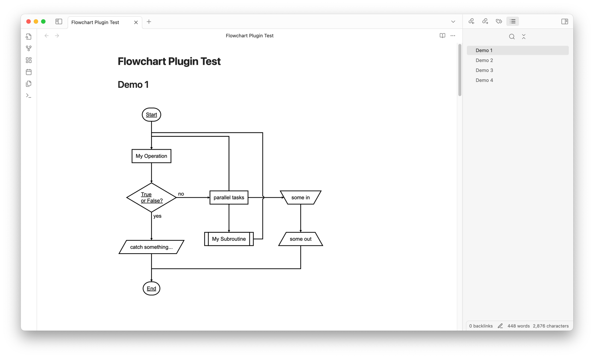

# Flowchart Plugin


This is a custom plugin for rendering flowcharts in Obsidian using **flowchart.js**. It allows users to insert and render flowcharts directly within Obsidian notes using a dedicated code block syntax.

## Features

- Renders flowcharts using `flowchart.js` syntax within Obsidian notes.
- Supports customization of flowchart styles, such as line width, font size, colors, and element styling, directly from the plugin settings.
- Adjustable settings for each part of the flowchart, including start and end symbols, decision conditions, operations, and more.
- Provides an easy way to create interactive and visually appealing diagrams in your notes.

## How to Use

1. Open a note in Obsidian and add a `flowchart` code block, like this:

   ````markdown
   ```flowchart
   st=>start: Start
   op=>operation: My Operation
   cond=>condition: Yes or No?
   e=>end: End

   st->op->cond
   cond(yes)->e
   cond(no)->op
   ```
   ````

2. The plugin will render the flowchart according to the configuration specified in the plugin settings. You can check more examples here: [Flowchart Plugin test](./Flowchart%20Plugin%20Test.md).



## Plugin Settings

The plugin includes various settings that allow you to customize the appearance of the flowchart:

- **Line Width**: Controls the width of lines in the flowchart.
- **Font Size**: Sets the font size for text within the flowchart.
- **Font Color**: Changes the color of the font.
- **Line Color**: Sets the color of the lines connecting elements.
- **Element Color**: Adjusts the color of the shapes around text.
- **Fill Color**: Sets the background fill color for elements.
- **Yes/No Text**: Customizes the labels for decision paths.

You can access these settings under **Settings** > **Community Plugins** > **Flowchart Plugin**.


## Development Guide

### Building the Plugin

To build the plugin:

- Run `npm run build` to compile the TypeScript code.
- Files will be output to the `dist` folder for use in Obsidian.

## Manually Installing the Plugin

If you'd like to install the plugin manually:

1. Copy `main.js`, `styles.css`, and `manifest.json` to your Obsidian vault at `.obsidian/plugins/obsidian-flowchart-plugin/`.
2. Reload Obsidian and enable the plugin in **Settings** > **Community Plugins**.

## Releasing New Versions

1. Update `manifest.json` with the new version.
2. Update `versions.json` to specify compatible Obsidian versions.
3. Create a GitHub release using the new version number as the tag.
4. Upload `manifest.json`, `main.js`, and `styles.css` to the release.

## Troubleshooting

If you encounter issues with rendering or plugin behavior:

- Ensure you are using a compatible version of Obsidian.
- Check the developer console (`Cmd + Option + I` on macOS or `Ctrl + Shift + I` on Windows/Linux) for error messages.
- Adjust settings to verify if certain configuration options are causing issues.

## Contributing

Contributions to improve the plugin or add new features are welcome! Submit a pull request or open an issue to discuss potential changes.

## License

This plugin is licensed under the MIT License.
